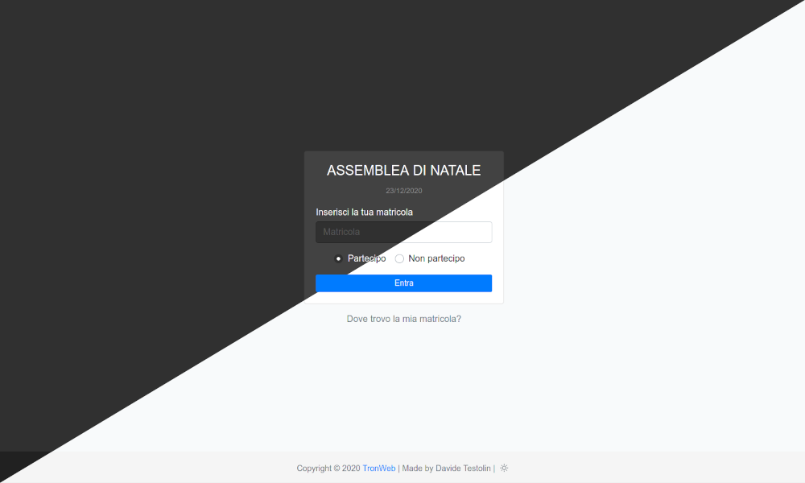

<p>
  
</p>

# AssembleeTron V5
AssembleeTron is a website build with the last technologies available for web development (Vue, ExpressJS, MongoDB) and it is meant to be a simple and flexible solution to the problem of subscription to the school assemblies.

### Installation
```
$~ git clone https://github.com/tronwebdevs/AssembleeTron.git
$~ cd client && npm i
$~ cd server
$~ npm i
$~ cp config.example.json config.json
```

#### Licensing
Copyright 2020 [TronWeb](https://www.tronweb.it)
